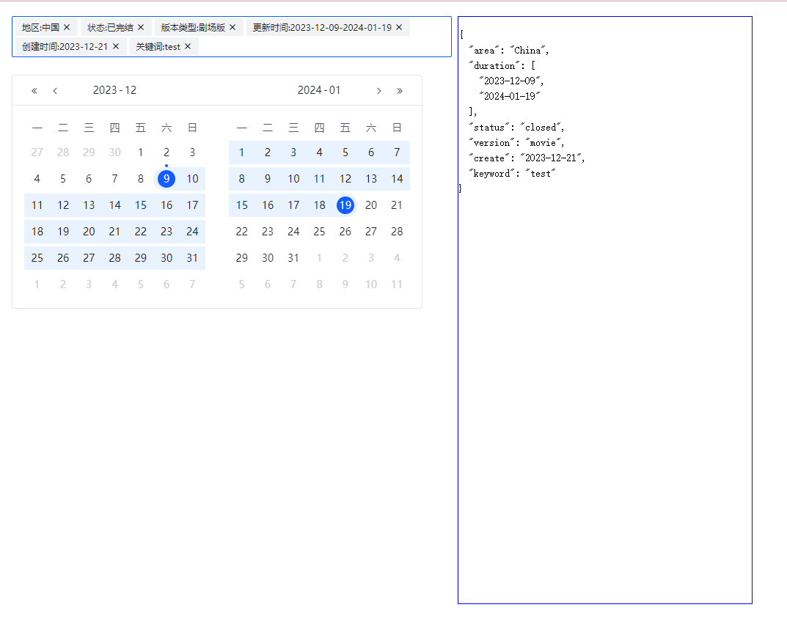

# My Repo

> Koloer Blus 的奇妙历险

## GetStart 

这是一个基于 [Rush](https://rushjs.io/pages/intro/get_started/) 的 Monorepo 项目，首选需要确保 node 和 pnpm 满足对应版本：

```json
"nodeSupportedVersionRange": ">=14.15.0 <15.0.0 || >=16.13.0 <17.0.0 || >=18.11.0 <19.0.0",
"pnpmVersion": "7.33.5",
```

然后按照如下操作来 安装 Rush 并且 安装依赖：

```

npm install -g @microsoft/rush

cd my-repo

rush update

```

之后就可以进入项目目录通过 `rushx` + `npm scripts` 启动或者构建项目了：

例如：

```

cd ./components

rushx dev


```

## Components

### CategorySearch 分类搜索组件 基于ArcoDesign (React)

> 支持一些简单的搜索聚合功能

